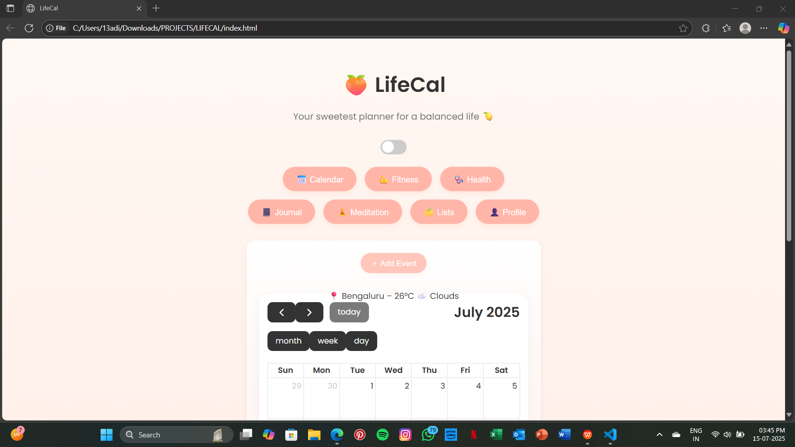
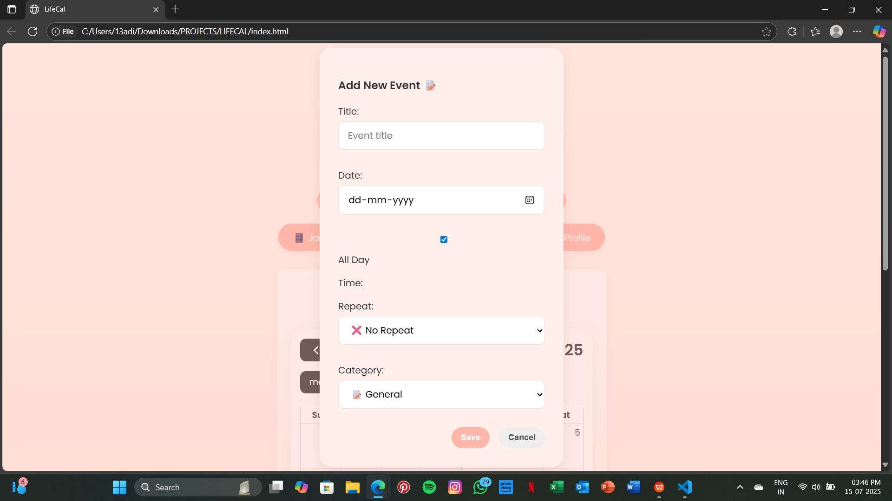
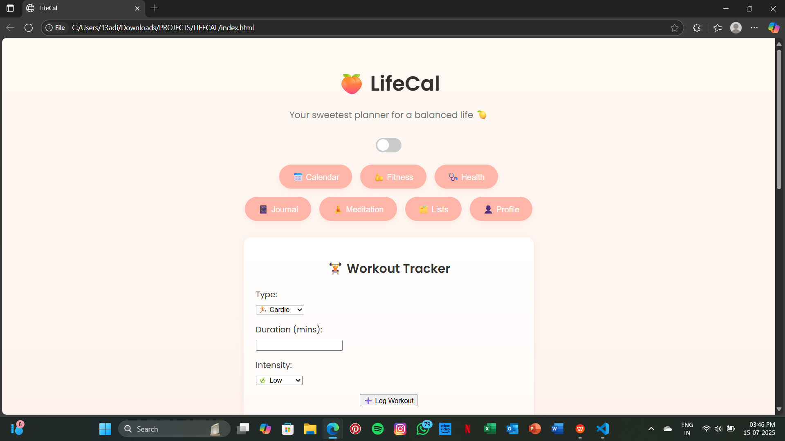
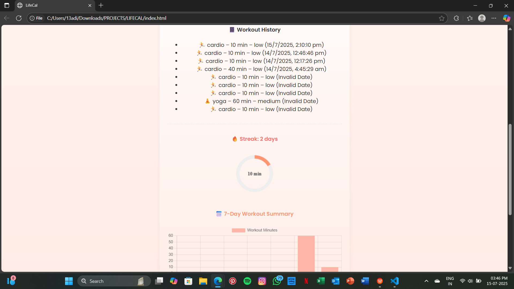
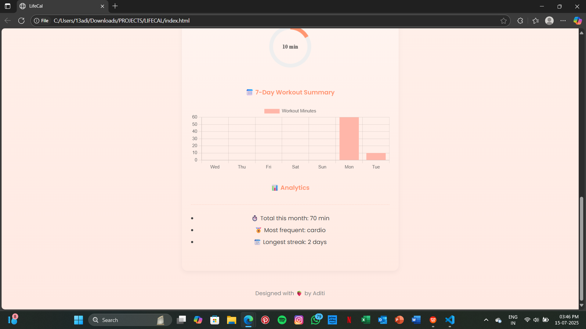

# 🍑 LifeCal

**LifeCal** is a warm, minimalist, and visually uplifting life planner web app that helps you organize and balance every part of your personal life—from events and workouts to journaling and mindful routines.

---

## 🌟 Vision

I built **LifeCal** out of pure necessity—and a little bit of frustration.

I’ve always been someone who *needs* to stay organized. Whether it’s planning out my week, journaling my thoughts, tracking my steps, or just reminding myself to drink more water—I feel calmer when everything’s written down.

But until now, that meant living across a bunch of different apps:
- 📅 Apple Calendar for events and reminders  
- 💪 Apple Fitness for workouts and step counts  
- 🩺 Apple Health for tracking sleep, heart rate, and more  
- 📝 Notes app for journaling and brain dumps  
- 📋 Reminders app for my to-do list and grocery runs  
- 🧘 Random sticky notes for water intake, mood checks, and meditation goals

It worked—kind of. But it felt scattered. Disjointed. Cold. I was jumping between apps made by different teams, designed for different purposes, none of which truly *fit* the way I wanted to plan my life.

So I built **LifeCal** with a simple but strong vision:  
> ✨ *To give your personal life the same beautiful, functional planning system your work calendar has—but with more soul.*

In a world full of productivity tools that feel too corporate, too serious, or too sterile, **LifeCal** is a soft space.  
It’s your peachy personal planner—a one-stop dashboard designed to help you *check in with yourself*, not just your deadlines.

No more bouncing between five different apps. No more cold interfaces or cluttered lists. Just one calm, thoughtful space where your events, routines, health, moods, dreams, and joys can all live together beautifully.

---

## 📦 Features (Current)

### 📅 Calendar
- Add, view, and delete personal events.
- Event categories: General, Fitness, Health, Personal.
- Repeat options: daily, weekly, yearly.
- Weather widget integration (Bengaluru).
- Emoji-based labels (🎂 Birthday, 🧘 Yoga, 🩺 Doctor, etc.).
- Confetti for birthdays 🎉

### 💪 Fitness Tracker
- Log workouts: cardio, strength, yoga, dance.
- View complete workout history.
- Daily progress ring (🎯 60 min goal).
- 7-day bar chart of workout duration.
- Monthly analytics:
  - Total minutes this month
  - Most frequent workout type
  - Longest active streak

### 🩺 Health *(Coming Soon)*
- Mood tracking
- Water intake
- Sleep logging
- Period tracking
- Mental journal
- Vital readings (heart rate, blood pressure)
- Weekly health summary charts

### Other
- Dark Toggle
- Real Time Weather Detection

---

## 🔜 Upcoming Features

- 🧘‍♀️ Meditation Tracker  
- 📓 Journal (daily reflection / gratitude)  
- 📋 Lists Section:  
  - ✅ Work/Study To-Dos  
  - 📚 Reading List  
  - 🎬 Watch List  
  - ✈️ Travel Wishlist  
- 👤 Profile Tab with theme and goal preferences  
- 🔔 Reminders / Notification system  
- 📱 Improved mobile responsiveness  

---

## 🛠️ Technologies Used

| Feature        | Tech                          |
|----------------|-------------------------------|
| Calendar       | [FullCalendar.js](https://fullcalendar.io/) |
| Charts         | [Chart.js](https://www.chartjs.org/)        |
| Weather API    | [OpenWeatherMap](https://openweathermap.org/) |

---

## 🖼️ Screenshots

|  |  |  |
|------------------------|------------------------|------------------------|

|  |  |  |
|------------------------|------------------------|------------------------|

---

## 🧑‍💻 Developer Notes

- Built from scratch using only HTML, CSS, and JavaScript.
- Works entirely offline thanks to `localStorage`.
- Designed to feel soft, human, and joyful.

---

## 🤍 Contributions

This is a personal passion project, but if you'd like to suggest features or report bugs, feel free to open an issue or fork the project.

